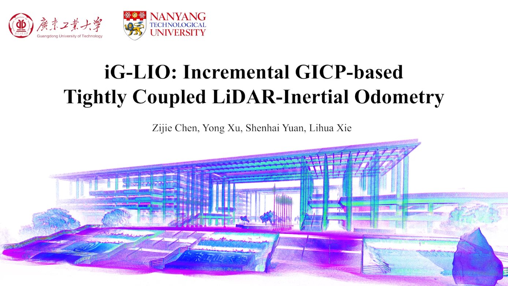
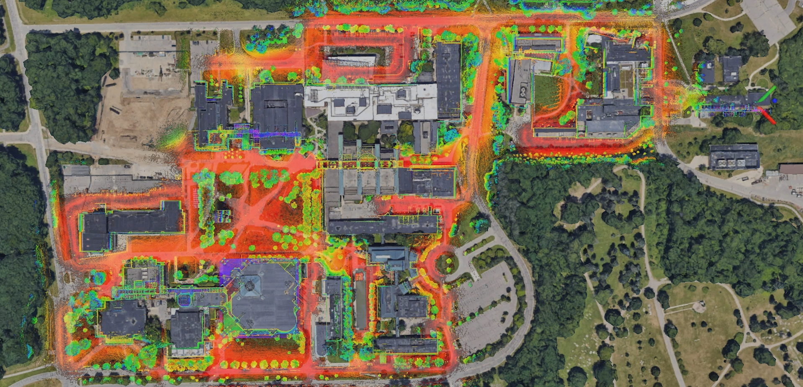
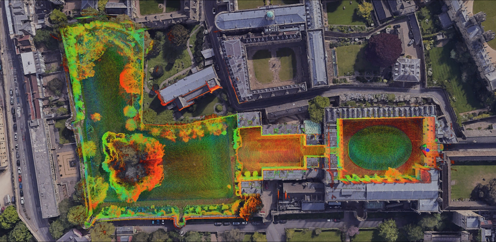
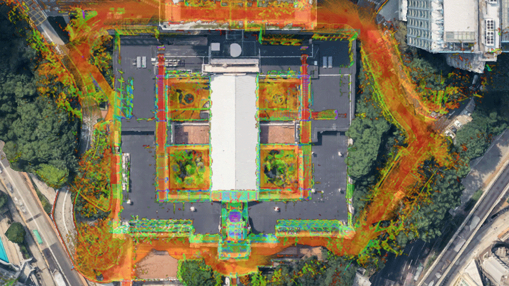

# iG-LIO


This work proposes an incremental Generalized Iterative Closest Point (GICP) based tightly-coupled LiDAR-inertial odometry (LIO), iG-LIO, which addresses the challenges of integrating GICP into real-time LIO. The main contributions are as follows.

- The raw GICP constraints are tightly-coupled with IMU constraints in a Maximum A Posteriori (MAP) estimation.
- A voxel-based surface covariance estimator (VSCE) is proposed to improve the efficiency and accuracy of the surface covariance estimation. Compared to the kd-tree based methods, VSCE reduces processing time in dense scans while maintaining the accuracy of iG-LIO in sparse and small FOV scans.
- An incremental voxel map is designed to represent the probabilistic models of surrounding environments. Compared to non-incremental methods (e.g., DLIO), it successfully reduces the time cost required for the nearest neighbor search and map management.
- Extensive datasets collected from different FOV LiDARs are adopted to evaluate the efficiency and accuracy of the proposed iG-LIO. Even though iG-LIO keeps identical parameters across all datasets, the results show that it is more efficient than Faster-LIO and achieves competitive performance compared to state-of-the-art LIO systems.

The experiment video can be found on **[YouTube ](https://youtu.be/zMktZdj4AAk), [bilibili](https://www.bilibili.com/video/BV1dt4y1Z7z7/)**.

The paper is available in [PDF](ig_lio_early_access.pdf).



## 1. Build

### 1.1 Docker Container

The docker-based standard development environment is available at https://github.com/zijiechenrobotics/ig_lio_workspace

### 1.2 Build from source

#### 1.2.1 Prerequisites

:one: **Ubuntu and ROS**

Ubuntu >= 18.04. And Ubuntu 20.04 is recommended.

:two: **GCC & G++ (only for Ubuntu 18.04)**

gcc & g++ >= 9

:three: **TBB (only for Ubuntu 18.04)**

TBB >= 2020. Please follow https://github.com/oneapi-src/oneTBB

:four: **livox_ros_driver**

```bash
git clone https://github.com/Livox-SDK/Livox-SDK
cd Livox-SDK
mkdir build
cd build
cmake ..
make -j
sudo make install
```

:five: **glog**

```bash
sudo apt-get install -y libgoogle-glog-dev
```

#### 1.2.2 Build

```bash
cd <your workspace>
mkdir src
cd src
git clone https://github.com/zijiechenrobotics/ig_lio_workspace.git
git clone https://github.com/Livox-SDK/livox_ros_driver
cd ..
catkin_make
```

## 2. Run
### 2.1 NCLT Dataset

Download NCLT from http://robots.engin.umich.edu/nclt/

```bash
source devel/setup.bash
roslaunch ig_lio lio_nclt.launch
```

### 2.2 NCD Dataset

Download NCD from https://ori-drs.github.io/newer-college-dataset/

```bash
source devel/setup.bash
roslaunch ig_lio lio_ncd.launch
```

### 2.3 ULHK Dataset

Download ULHK from https://github.com/weisongwen/UrbanLoco

```bash
source devel/setup.bash
roslaunch ig_lio lio_ulhk.launch
```

### 2.4 AVIA Dataset

Download AVIA from https://drive.google.com/drive/folders/1CGYEJ9-wWjr8INyan6q1BZz_5VtGB-fP (fast-lio) and https://github.com/ziv-lin/r3live_dataset (r3live)

```bash
source devel/setup.bash
roslaunch ig_lio lio_avia.launch
```

The fast-lio datasets miss the gravitational constant in the accelerometer. Please edit the `avia.ymal`

```bash
# for fast-lio
enable_acc_correct: true

# for r3live
enable_acc_correct: false
```

### 2.5 Botanic Garden Dataset

Download Botanic Garden from https://github.com/robot-pesg/BotanicGarden

```bash
source devel/setup.bash
# for avia
roslaunch ig_lio lio_bg_avia.launch
# for velodyne
roslaunch ig_lio lio_bg_velodyne.launch
```

### 2.6 Run with your own dataset

:one: **Edit `.yaml` files in `ig_lio/config`**

- `lidar_topic`: LiDAR topic name.
- `imu_topic`: IMU topic name.
- `lidar_type`: The type of LiDAR you use. Only support for Velodyne, Ouster, and Livox.
- `min_radius` & `max_radius`: A range filter to remove laser point from the robot itself.
- `enable_ahrs_initalization`: Set true or false. If the IMU message has orientation channel, iG-LIO can be initialized via AHRS.
- `enable_acc_correct`: Set true or false. If the accelerometer miss the gravitational constant, please set true (e.g., fast-lio2 datasets).
- `gravity`: **Make sure the gravity is correct**. Some datasets are 9.81, some datasets are -9.81, and even zero (e.g., ULHK). A simple debugging method is to observe the glog message. The normal range of ba_norm is 0~0.5.
- `t_imu_lidar` & `R_imu_lidar`: The extrinsic parameters from LiDAR frame to IMU frame (i.e. the IMU is the base frame).

:two: **Launch iG-LIO**

```bash
source devel/setup.bash
roslaunch ig_lio <your launch file name>.launch

rosbay play <your rosbag>
```


## 3. Details about all sequences in the paper

We use abbreviations for all sequences due to limited space. The full names of all sequences are presented below.

| Abbreviation |                      Name                      | Distance(km) |         Sensor Type          |
| :----------: | :--------------------------------------------: | :----------: | :--------------------------: |
|    nclt_1    |                   2012-01-15                   |     7.58     |       Velodyne HDL-32E       |
|    nclt_2    |                   2012-04-29                   |     3.17     |       Velodyne HDL-32E       |
|    nclt_3    |                   2012-05-11                   |     6.12     |       Velodyne HDL-32E       |
|    nclt_4    |                   2012-06-15                   |     4.09     |       Velodyne HDL-32E       |
|    nclt_5    |                   2013-01-10                   |     1.14     |       Velodyne HDL-32E       |
|    ncd_1     |              01_short_experiment               |     1.61     |        Ouster OS1-64         |
|    ncd_2     |               02_long_experiment               |     3.06     |        Ouster OS1-64         |
|    ncd_3     |             05_quad_with_dynamics              |     0.48     |        Ouster OS1-64         |
|    ncd_4     |              06_dynamic_spinning               |     0.09     |        Ouster OS1-64         |
|    ncd_5     |               07_parkland_mound                |     0.70     |        Ouster OS1-64         |
|    ulhk_1    |                HK-Data20190117                 |     0.60     |       Velodyne HDL-32E       |
|    ulhk_2    |               HK-Data20190426-2                |     0.74     |       Velodyne HDL-32E       |
|     bg_1     |                    1006-01                     |     0.76     | Velodyne VLP-16 & Livox AVIA |
|     bg_2     |                    1008-03                     |     0.74     | Velodyne VLP-16 & Livox AVIA |
|    avia_1    |                hku_main_buiding                |     0.96     |          Livox AVIA          |
|    avia_2    | outdoor_Mainbuilding_100Hz_2020-12-24-16-46-29 |     0.14     |          Livox AVIA          |
|    avia_3    |     outdoor_run_100Hz_2020-12-27-17-12-19      |     0.09     |          Livox AVIA          |

## 4. Mapping Results

We aligned the mapping results of iG-LIO with Google Earth and found that iG-LIO retains global consistency maps.

### NCLT 2012-05-11



### Newer College Dataset 02_long_experiment



### hku_main_building



## 5. Paper
Thanks for citing iG-LIO (RA-L 2024) if you use any of this code.

```
# IEEE Robotics and Automation Letters ( Early Access )
@ARTICLE{10380742,
  author={Chen, Zijie and Xu, Yong and Yuan, Shenghai and Xie, Lihua},
  journal={IEEE Robotics and Automation Letters}, 
  title={iG-LIO: An Incremental GICP-based Tightly-coupled LiDAR-inertial Odometry}, 
  year={2024},
  volume={},
  number={},
  pages={1-8},
  doi={10.1109/LRA.2024.3349915}}
```

## 6. Acknowledgements

Thanks for the below great open-source project for providing references to this work.

1. LOAM (J. Zhang and S. Singh. LOAM: Lidar Odometry and Mapping in Real-time)
2. [FAST-LIO](https://github.com/hku-mars/FAST_LIO)
3. [Faster-LIO](https://github.com/gaoxiang12/faster-lio)
4. [LINS](https://github.com/ChaoqinRobotics/LINS---LiDAR-inertial-SLAM)
5. [SLICT](https://github.com/brytsknguyen/slict)

Thanks for the following public dataset.

1. [NCLT](http://robots.engin.umich.edu/nclt/)
2. [Newer College Dataset](https://ori-drs.github.io/newer-college-dataset/)
3. [Botanic Garden](https://github.com/robot-pesg/BotanicGarden)
4. [R3live](https://github.com/ziv-lin/r3live_dataset)

## 7. Known Issues

**What can’t iG-LIO do?**

- The extremely narrow environment (e.g., some sequence in the Hilti SLAM Challenge).
- The scene is very open and devoid of geometric features.

## 8. Time Line

| Time         | Event                                                        |
| ------------ | ------------------------------------------------------------ |
| Aug 13, 2023 | **😀** Paper submitted to IEEE Robotics and Automation Letters (RA-L) |
| Nov 5, 2023  | **😭** Revise and resubmit                                    |
| Dec 22, 2023 | **🥳** Paper accepted for publication in RA-L                 |
| Current      | **🎉** Source code released                                   |
